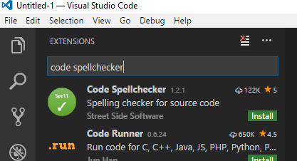
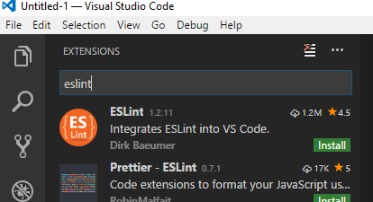
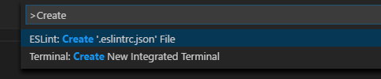
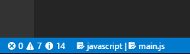
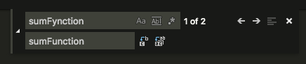
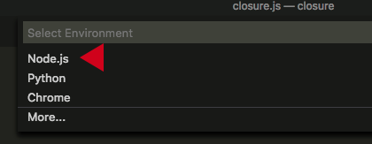

# VSCode Tips

Although you are free to make you own choice of text/code editor to use during class and homework, we have good experiences with Microsoft's free Visual Studio Code (VSCode) editor.

From the [VSCode web site](https://code.visualstudio.com/):

> Visual Studio Code is a lightweight but powerful source code editor which runs on your desktop and is available for Windows, macOS and Linux. It comes with built-in support for JavaScript, TypeScript and Node.js and has a rich ecosystem of extensions for other languages (such as C++, C#, Java, Python, PHP, Go) and runtimes (such as .NET and Unity).

Here are some tips for getting up to speed with VSCode as you progress through this course.

## Installation

Download and install the appropriate version of VSCode for your operating system from the [VSCode web site](https://code.visualstudio.com/).

## Some useful extensions

VSCode can be extended with _extensions_. There are two that we recommend you install from day 1.

**Spell Checker**. We fully understand that you guys sometimes have difficulty with the correct English spelling when choosing names for variables and functions in your JavaScript programs. That is nothing to be ashamed of, but why not get some help from a handy extension?

**ESLint**. This extension can check your JavaScript code for obvious errors, such as undefined variables, unused variables, etc.

### Installation instructions

1. Start up VSCode.

2. Press the last button in the area in left margin (called the Activity Bar), shown below:
	<br />

3. In the input field in the upper left corner, type `code spellchecker` as pictured here:

	

4. Press the green `install` button of **Code Spellchecker**.
5. When the installation has finished, install the ESLint extension in a similar fashion:

	

6. When this second extension has finished installing you will notice that the green `install` button changes to a blue `reload` button. But no need to press this button at this time (no harm done if you did).
7. You now need to install a global Node package to support ESLint. Open a terminal window in VSCode by selecting **View**, **Integrated Terminal** from the menu bar.
8. A terminal window opens in the lower half of the VSCode window. In this window, type the command below (on Linux and MacOS systems you may need to prefix this command with `sudo`, e.g. `sudo npm ...`):

	```
	npm install -g eslint
	```


9. Once the installation has finished close VSCode for now.

## Customise VSCode Settings

We recommend that you apply two changes to the default settings of VSCode to help you create well-formatted JavaScript code. Follow these steps:

1. Press the cog-wheel icon in the lower-left corner of the VSCode screen, as indicated here:

	

2. From the menu, select **Settings**.
3. In the `USER SETTINGS` tab in the right-hand half of the screen add the two lines indicated below between the curly braces:

```json
/// Place your settings in this file to overwrite the default settings
{
  "editor.formatOnType": true,
  "editor.formatOnPaste": true
}
```

4. Close the User Settings tab.

## Using VSCode for your homework

You’ll get the most out of VSCode if you organise your work in folders, say a folder for each week in the JavaScript module.

(Later in the course you will be “cloning” Git repositories into local folders as the basis for your homework or projects.)

To start work with VSCode in particular folder, start VSCode and open the relevant folder: from the menu, select **File**, **Open Folder**. VSCode will now open this folder to be your "project folder", until you close VSCode or open another folder.

Assuming that you will use the folder for JavaScript work, you need to create a special file inside of it as required by ESlint.

From the menu, select **View**, **Command Palette…** and type `create` as show in the picture below. Select: **Create** '.eslintrc.json' File.



The `.eslintrc.json` file will now be created in the project folder. No need to touch this file at this time, it just needs to sit in your project folder. Later in the course you may wish to add additional "rules" to this file for more stringent code checking.

## Creating your JavaScript file

You are now ready to start adding your first JavaScript file.

1. From the menu, select **File**, **New File**. This will create a new, empty file named "Untitled-1".
2. Select **File**, **Save** from the menu and give your file a an appropriate name. Make sure that you give it an extension ".js" to make it a JavaScript file.
3. Start entering your JavaScript code in the new file. Be on the watch out for green squirly underlines. These are warnings from either ESLint or the Spell Checker that something might be wrong.
4. If you see green squirly underlines, hover your mouse pointer over the underlined text and a tooltip will appear that explains what might be wrong.
5. You can also open the "problem" panel by selecting **View**, **Problems** from the menu to see any problems identified.
6. Pay attention also to the lower left part of the VSCode window, i.e. the status bar. It gives an indication of the number of errors and warnings issued. In the picture below there are zero errors, 7 warnings (usually from ESLint) and 14 informational messages (usually from the spell checker).

	

## Some useful short-cut commands

In the previous section we frequently referred you to the menu bar to select commands. As you get more proficient with VSCode you may want to inspect these menus a little closer and take note of the short-cut commands listed in their right margin. For example, the short-cut command for **File**, **New** is listed as Ctrl+N (press `Ctrl` and `N` keys simultaneously) on a Windows or Linux PC and ⌘N on a Mac.

Here are some short-cut commands that you will use many times a day and that we recommend you familiarise yourself with from day 1:

| Operation | Windows | Mac   | Linux |
| --------- | ------- | ----- | ----- |
| **Format Document** (make it pretty) | Shift‑Alt‑F | ⇧⌥F| Ctrl‑Shift‑I |
| **Search** (Find)| Ctrl+F | ⌘F | Ctrl+F |
| **Replace** (Find and replace) | Ctrl+H | ⌥⌘F | Ctrl+H |
| **Rename Symbol** (change all names in file to a different name) | F2 | F2 | F2 |
| Open an **Integrated Terminal** window in VSCode  | Ctrl+' | ⌃\` | Ctrl+' |

- **Format Document**. This command reformats your JavaScript file in a generally accepted standard format, using proper indenting, proper use of spaces, placing of curly braces and more. A neatly formatted document helps you to better understand your own code and your teachers, mentors and fellow students will love your for it too when they review your work.

	*With VSCode at your finger tips there is no longer any excuse for submitting poorly formatted homework!*

- **Search**. Search for specified text.
- **Replace**. Replace specified text by some other text.

	In the figure below the **Replace** pop-up window is shown. The **Search** pop-up is similar, but with one input field only.

	

	- The `Aa` button activates the **Match Case** option.
	- The `Ab|` button matches **Whole Words Only**.
	- The `.*` button allow you to search using _regular expressions_, which you may encounter in later modules as an advanced JavaScript programming topic.
	- The `c-b` button next to the second input field replaces the next occurrence of the matched text.
	- The `ab-ac` button replaces **all** occurrences of the matched text.
	- The left and right arrows move the cursor to the previous and next match.
	- To get rid of the pop-up press `Esc` or press the `x` button.

- **Rename Symbol**. This command renames all occurrences of a JavaScript variable or function name. To do so, move the text cursor to the variable or function name and press F2. A small pop-up window will appear in which you can type a new name. Press Enter to finalise the change or Esc to cancel it.

- **Open an Integrated Terminal window**. We already covered this when we mentioned the **View**, **Integrated Terminal** menu command.

## Running and debugging your code with the VSCode Node debugger

If your JavaScript program is contained in a single file the easiest way to run and examine your code is the start straight in VSCode.

1. Press the F5 function key to start the VSCode debugger.

2. You will prompted to select an environment. Choose `Node.js` as show below.

	

This starts your program in the VSCode debugger.

### Placing break points and inspecting variables

This is covered in class.

### Further information

Please note that VSCode is actively being developed. At present there is a monthly release cycle, so don't be surprised when you are prompted once a month to update to the latest version.  We advise you to update when prompted (naturally, not when you are in the middle something that you don't want interrupted).

You can find detailed information about VSCode at the [VSCode web site](https://code.visualstudio.com/docs).
