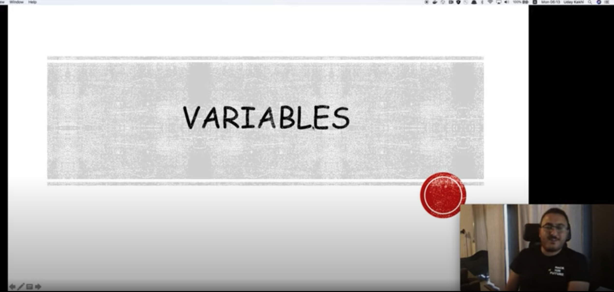
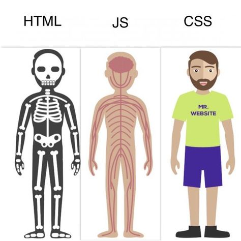

# Reading Material JavaScript1 Week 1

## Agenda

These are the topics for week 1:

1. What is programming?
   - Software
   - What is a programming language?
2. What is web development?
   - Web development vs. software development
   - Web development vs. web design
   - Website vs. web application
3. What is JavaScript?
4. What are variables?
   - The keywords: let, const, var
   - values
5. What are data types?
   - 6 basic types

## 0. Video Lectures

Your teacher Uday has made video lectures for this week's material. You can find them here: [Videos 1 - 10](https://www.youtube.com/playlist?list=PLVYDhqbgYpYUiqH8IxLJ5qomkEGMzes1q)

<a href="https://www.youtube.com/watch?v=9yR6tC7OGiE&list=PLVYDhqbgYpYU5EOlYroMUri1K6snlSE-2" target="_blank"></a>

## 1. What is programming?

Programming is giving a computer instructions written in a language it can understand, in order to solve a problem you (or the company you work for) have. We don't necessarily need computers to solve problems, but we use them because they provide several benefits:

1. They are fast
2. Cheap to use
3. Can work 24/7 (as long as it has power)

This is important to note: a computer is a `tool` we use to make our lives easier.

- [What is a Computer?](https://www.youtube.com/watch?v=rRSD128KWIM)
- [What Do Computers Do?](https://www.youtube.com/watch?v=92TaQRBwPSs)

In order to use this tool, we need to talk to it in a way it understands (programming language) and give it commands on what to do (the act of programming). However, despite the power a computer has it is not very smart. It can't do anything without being told **exactly** what it needs to do to solve a problem, step-by-step. This is why we learn how to program: in order to tell the computer to do what we want it to do.

Go through the following resources to learn more about what programming is:

- [What is programming?](https://www.youtube.com/watch?v=3tWMQ3ZMjbg)
- [What do programmers do?](https://www.youtube.com/watch?v=kEjCfsrotAM)
- [Introduction into programming Playlist](https://www.youtube.com/playlist?list=PLRqwX-V7Uu6ZYJC7L-r6rX6utt6wwJCyi)

### Software

As a software developer (synonym to 'programmer' or 'software engineer'), you will write these instructions in order to create 'software'. Look at the following video to get a better idea of what software is:

- [What is software?](https://www.youtube.com/watch?v=MSA3WsGeTNI)

### What is a programming language?

Programming is done using a programming language. Why do we need a language to communicate with the computer? At its most basic level, a computer operates based on 0's and 1's: the 0 means 'off', and the 1 means 'on' (think of it like a light switch that either turns the light on or off).

Smart people decided to make working with this easier to understand, so that a lot of people can more simply communicate with a computer. This is how the development of programming languages started: by defining a vocabulary, grammar and syntax to put more organization to the 0's and 1's, we can more simply communicate exactly what we want to computer to do.

- [What is a programming language?](https://www.youtube.com/watch?v=EGQh5SZctaE)
- [What are programming languages](https://hackr.io/blog/what-is-programming-language)

There are various languages, each made to fulfill a certain need. For example, Microsoft developed a language called [C#](https://www.youtube.com/watch?v=paJUbVeKEOU) in order to make applications for computers that run a Windows operating system. The language of C# is able to easily "talk" with the preexisting software.

You will be learning JavaScript, a language that has been made to "talk" to web browsers (Google Chrome, Mozilla Firefox, Safari, Internet Explorer, etc.).

Read the following article to learn more about different languages and their uses:

- [14 Programming Languages Explained](https://mikkegoes.com/14-programming-languages-explained/)

## 1. What is web development?

In HackYourFuture we focus on `web programmming` (also known as `web development`): writing code that creates websites and web applications. Look at the following video to learn about what you'll be doing:

- [What does a web developer do?](https://www.youtube.com/watch?v=GEfuOMzRgXo)

## Web development vs. software development

The field of programming is broad. As a software developer (a general term for anyone that writes code to create software) there are several career paths you might take. The following are some of the biggest:

1. **Web**. Developing websites and web applications to be accessed and used in the browser
2. **Mobile**. This refers mostly to Android and iOS application development
3. **Desktop**. Every application on your computer has been made by desktop developers
4. **Data science**. Writing custom programs to extract patterns from big piles of data is what this developer does
5. **Gaming**. Game developers work with a variety of designers, artists and testers to realize a video game
6. **Quality Assurance**. Applications need to be tested, and these developers write tests that check for the correct working of any piece of code

Read the following article to read more about different career paths:

- [Software Development Career Paths](https://simpleprogrammer.com/software-development-career-paths/#title-career-developer-options)

Note: once you've chosen a certain track it doesn't mean you can't try out any other! If anything, you are encouraged to explore and see what fits your taste, while building your career :)

### Web development vs. web design

You might have heard these terms used interchangeably. They are, however, two different things. A web developer writes code and handles the logical, technical side. A web designer decides how things are going to look and handles the creative side. The following video will explain this more clearly:

[Web Developer vs. Web Designer](https://www.youtube.com/watch?v=bDtxF7qSofg)

### Websites vs. web applications

Before we get started with the meat of the module (which is JavaScript), we need to make a small but important distinction: are we going to make websites or web applications? For non-developers, there is no difference but for you as a developer you must know what it is that you'll be producing.

The difference between a website and a web application is the difference between [Wikipedia](https://www.wikipedia.org) and [Facebook](https://wwww.facebook.com). In Facebook, the data shown changes depending on the user. If you are logged in, you'll see different things than that I will. However, on Wikipedia the information will always be the same, for both you and me.

In other words, we're talking about `static`(= website) versus `dynamic` (= application) sites: a static site always has the same information and serves only to be information, while a dynamic site changes the data shown to the user depending on who it is and what their interactivity on the page is.

Read the following articles to learn more about this:

- [Website vs. Web Application](https://www.seguetech.com/website-vs-web-application-whats-the-difference/)
- [Static vs. dynamic websites](https://www.youtube.com/watch?v=4sP7fp3cp24)

## 3. What is JavaScript?

JavaScript is a programming language. We use it to communicate with the browser, software that allows us to access the Internet and open webpages. It is essential to learn in order to become a web developer.

You've already learned what HTML and CSS do. Javascript is the third part that makes the circle complete. If we liken the three to the human body, we could say that HTML provides the skeleton with all the basic content, CSS makes the skin/shape to determine the look, and JavaScript is the brain and muscles to allow for interactivity.



The main use for JavaScript is to make your webpage interactive: for example, if you click a button it will open a popup. Or if you scroll over an image, it changes its color.

Check the following resources to learn more about it:

- [What is JavaScript?](https://www.youtube.com/watch?v=nItSSTwBvSU)
- [What does JavaScript do and what is it used for?](https://www.youtube.com/watch?v=OSWppEa2Zac)

## 4. What are variables?

A `variable` is a box that contains a piece of information, to be saved for later use. You give it a name that describes what its contents are, and to also refer to it at a later point.

- [Beginner Programming Concepts - What's a Variable?
  ](https://www.youtube.com/watch?v=Jvrszgiexg0)

### The keywords: let, const, var

The concept of a `variable` is a central concept within programming. It's applied the same way across almost all programming languages. In JavaScript we apply it by using a special `keyword`, a word that is reserved by the language because it has a special meaning.

The keywords are `var`, `let` and `const`.

Read more about this in the following article:

- [Variables](https://github.com/HackYourFuture/fundamentals/blob/master/fundamentals/variables.md)

A variable always contains a `value`: the piece of information that you want to save and refer to at a later stage. Read more about this here:

- [Values](https://www.github.com/hackyourfuture/fundamentals/blob/master/fundamentals/values.md)

When creating variables, it's important to think about the right name to give it. It should always reflect what "type" of data it contains and what its purpose is. You (and other developers that will read your code) should be able to read a variable name and know what its purpose is.

Why do we need variables? You'll be using variables **to manipulate its content** (the value inside the variable). Why would you want to do this? For most of the time, you want to perform some kind of calculation. The most basic example is the following:

```js
const one = 1;
const two = one + one;
```

Here we have assigned to a new variable the calculation `one` plus `one`. Why have we put the end result into a new variable? It is because the result of the calculation will **not be remembered** later. Memory works differently in computers: after a calculation is finished a computer thinks its job is done. The result will not exist after, unless explicitly captured within a variable.

This is something that you will learn when you start coding yourself. If you can't wait you can already look at the [homework](./MAKEME.md).

## 5. What are data types?

A data type is a category of data. It tells the code interpreter what kind of data it is reading so it knows how to process and optimally store it in memory.

An example of this is the `Number` type. In most programming languages, when it reads the number `2` it doesn't know that it's a number. It needs to be told that the character `2` is of the `Number` data type.

## 6 Basic types

There are about `6 basic data types` in JavaScript:

- `String`
- `Number`
- `Boolean`
- `Object`
- `Array`
- `Function`

A data type, or data structure, is a way of organizing information. Computers need to know how to look at any piece of information, and it can interpret it only if it fits into one of the aforementioned data types.

You can read more about them in the following article:

- [JavaScript Data Types](https://www.tutorialrepublic.com/javascript-tutorial/javascript-data-types.php)
- [JS Data Types](https://www.w3schools.com/js/js_datatypes.asp)
- [Variables & Data Types](https://www.youtube.com/watch?v=Hrd3SfCCXZw)

Why do you need to know this? Again, this goes back to computers not being very smart: it needs to know **exactly** how to look at things, what to do with it and in what order.

In JavaScript, the data types allow us to store various types of information, and perform manipulations on them. You'll learn more about them at a later stage.

## Extra resources

If you feel like you need more information to fill in the gaps of your understanding, check out the following resources to learn more about the basics of JavaScript:

- [Introduction to JavaScript Development](https://www.udemy.com/refactoru-intro-js)

## Finished?

Are you finished with going through the materials? You're doing great! If you feel ready to get practical, click [here](./MAKEME.md).
