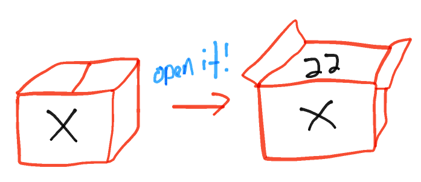

# REVIEW JavaScript Basics week 1

```
This review covers:
• some commands thought by Unmesh in class today 
• Intro JavaScript (What is it, where can you use it for)
• Variables [var, let, const] 
• Basic Data types [Strings, Numbers, Arrays] 
• Operators
```

## CLI
```
pwd : present working directory
ls : List files in the directory
cd : change the directory
touch: Create an empty file
echo : display the string
echo -n : Display the string without newline
echo “something” > file : Redirect the output of echo and create file
echo “another thing” >> file : Append the string to the file
mkdir: make a new directory
cd ~ : home
cd - : previous directory
cd .. : parent directory
ls -a : List all files including hidden files
cd / : change to the root directory
cat : Concatenate the file line by line and display it on the terminal
less: Print the big file line by line
vim <file> : open the editor with <file> {a: to go to the insert mode, <ESC>:wq  to write and quit }
for var in {START..END}; do <COMMAND1>; <COMMAND2>;..; ; done
head <file>: display the first 10 lines of file
tail <file>: display the last 10 lines of file
head -n <file> : display first n lines of file
tail -n <file> : display last n lines of file
man <COMMAND> : Display manual of the COMMAND
```

:star: Highly recommended :star: :take a look at the Command Line [repository](https://github.com/HackYourFuture/CommandLine) and especially review the preparations of the first lecture: https://github.com/HackYourFuture/CommandLine/blob/master/Lecture-1.md

## Variables

A "variable" is a place where you can store information, such as a string, or a number. New variables in JavaScript are declared using one of three keywords: let, const, or var.

> Think of variables names like **labels** on boxes, while the value of the variable are the **contents** of the box - you could change the contents of a box and leave the label intact, the contents of the boxes can have different types, the boxes should have good labels (a box of books being labeled pens would be very confusing),
>

> Photo from [Khan Academy](http://cs-blog.khanacademy.org/2013/09/teaching-variables-analogies-and.html)


### Variable declaration

Variables are "declared" using the `var`, `let` or `const` keyword:

```js
var x;
let foo;
const bar;
```

### let and const
- read about [let](https://developer.mozilla.org/en-US/docs/Web/JavaScript/Reference/Statements/let)
- read about [const](https://developer.mozilla.org/nl/docs/Web/JavaScript/Reference/Statements/const)
- [let vs const] (http://wesbos.com/let-vs-const/) 

Here, we say: "declare variable x and initialize it with the integer (number) 5".

```js
let foo;  // declare variable `foo`
```

```js
let foo = 6; // declare and assign a variable at the same time
```

You can also assign a value to an existing variable:
```js
foo = 4;  // change variable `foo`
```


## Variable types

All variables have a type. In our example above, the variable `x` is a `number`. JavaScript supports the following types:

* `string`, e.g. "HackYourFuture"
* `number`, e.g. 5, or 10.6
* `boolean`, e.g. `true` or `false`
* `array`\*, e.g. `[1, 2, 3]` or `['what', 'is', 'your', 'name']`
* `object`, e.g. `{name: 'John', age: 24}`, or the special object `null`
* `function`, e.g. `function () { return 4; }`
* `symbol`

In addition, a variable may be `undefined`. This is also a special type.

To get the type of a variable, use the following code:

```js
let x = 5;
let typeOfX = typeof x; // -> 'number'
```

Note that I've put an asterisk behind 'array'. That is because in JavaScript, array is a special kind of object:

```js
let arr = [1, 2, 3];
let typeOfArr = typeof arr; // -> 'object'
```

However, in our communication, we will call these variables arrays.

### Null & undefined

The values `null` and `undefined` are very similar in JavaScript, but they behave a bit differently. The difference is that `null` always has type "object", and `undefined` always has type "undefined".

Whenever you declare a variable, but you don't set a value, the variable will become `undefined`. JavaScript will never make a variable `null` unless you explicitly program it.

```js
let x;
console.log(typeof x); // -> 'undefined'
```


### Typeof

You can use `typeof` to get the type of a certain variable as you have seen in the above section 'Variable types'. As you can see in the following examples it returns the type of data that you have stored in your variable. 

## Strings

In JavaScript you can store a series of characters inside a variable, you then call this a string. You can store all sorts of characters (text/numbers, spaces or phrases) in strings. By using the `''` you define that something is a string. You can also use `""` to create a string. Both are fine as long as you are consistent (just make a choice on which one you prefer and stick to it).

```js
let foo = '42';
typeof foo   //-> 'string'

let bar = 'I\'m 99 years old '; 
typeof bar   //-> 'string'
```

### String indexes and string properties
The index of a string always starts at 0.
Strings also have properties, for example `.length` you can use this to find the length of a string.

So for example:
```js
let baz = 'Hello World';
baz[0]; //-> "H"
baz.length; //-> 11
```

### String methods

>Todo

## Numbers

All numbers in JavaScript are considered numbers with or without decimal

```js
let quux = 42;    
typeof quux  //-> 'number'

let quuux = 3.3333;
typeof quuux //-> 'number'

```


## Arrays

Variables that are arrays contain a list of things, instead of just one thing. What's inside the array, we typically call "elements". So, the array `[1, 2, 3]` has three elements. The array `[]` has no elements and is therefore empty. The number of elements in an array is called its "length".

When you want to access an element inside an array, you use an "index". This is the number that you put between brackets (`[]`).

Given the following code:

```js
var arr = ['john', 'jane', 'jack'];
console.log(arr[0]);
```

The number `0` is the "index of the first element of array `arr`". Conversely, the element "at index 0 in array `arr` is `'john'`".

Instead of a number, you can also use a variable to access elements in an array, *as long as this variable is a number*:

```js
let arr = ['john', 'jane', 'jack'];
let a = 1;
console.log(arr[a]); // -> jane
```

If the index you use is not an integer (a whole number), or if it's less than `0` or if it's greater than or equal to the array's length, you will get back `undefined`.

More about [arrays](https://developer.mozilla.org/en-US/docs/Web/JavaScript/Reference/Global_Objects/Array)

### Comparison operators

>Note the two different uses of the equals sign:
A single equals sign (=) is used to assign a value to a variable.
A triple equals sign (===) is used to compare two values (see Equality Operators).

#### Equality operators
* Equality `==`
* Inequality `!=`
* Identity / strict equality `===`
* Non-identity / strict inequality `!==`

How does this work in practice?

```js
1 == 1 // -> true
7 == '7' // -> true
1 != 2  // -> true
5 === 5  // -> true
9 === '9'  // -> false
3 !== 3 // -> false
3 !== '3' // -> true
```

> why does `7 == '7'` returns true and `9 === '9'` returns false?

#### Relational operators
* Greater than operator `>`
* Greater than or equal operator `>=`
* Less than operator `<`
* Less than or equal operator `<=`

```js 
4 > 3   // -> true
3 >= 3  // -> true
13 < 12 // -> false
3 <= 4   // -> true
```

More about [comparison operators](https://developer.mozilla.org/en-US/docs/Web/JavaScript/Reference/Operators/Comparison_Operators)

### Arithmetic operators

* Addition `+`
* Subtraction `-`
* Multiplication `*`
* Division `/`       
* Remainder (sometimes called modulo) `%`   
<br>Returns the remainder left over after you've shared the left number out into a number of integer portions equal to the right number.

```js
8 + 9 // -> 17, adds two numbers together.  
20 - 12 // -> 8, subtracts the right number from the left.
3 * 4 // -> 12, multiplies two numbers together.
10 / 5 // -> 2, divides the left number by the right.   
8 % 3 /// -> 2, as three goes into 8 twice, leaving 2 left over.
```

More about [Arithmetic_Operators](https://developer.mozilla.org/en-US/docs/Web/JavaScript/Reference/Operators/Arithmetic_Operators#.25_.28Modulus.29)

### Logical operators

* AND `&&`
* OR `||` 
* NOT `!`

Given that x = 6 and y = 3
```js
x < 10 && y > 1 // -> true
x == 5 || y == 5 // -> false
x !== y // -> true
```

More about [logical operators](https://developer.mozilla.org/en-US/docs/Web/JavaScript/Reference/Operators/Logical_Operators)

### Operator precedence

There are compound assignment operators such as +=. The following two assignments are equivalent:

```js
x += 1;
x = x + 1;
```

|Operator|  Example| Same As|
-----------------------------
|= |  x = y|   x = y|
|+=|  x += y|  x = x + y|
|-=|  x -= y|  x = x - y|
|*=|  x *= y|  x = x * y|
|/=|  x /= y|  x = x / y|
|%=|  x %= y|  x = x % y|
