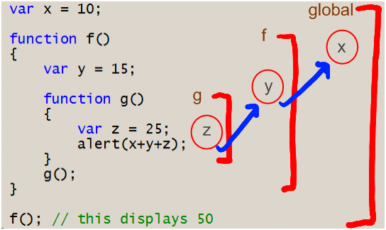

# Lesson Plan JavaScript1 Week 3

## Agenda

The purpose of this class is to introduce to the student:

- What is a function (ES5 only)
- Wat is scope (global, functional, block)
- How to combine variables, loops & functions

## Core concepts

FIRST HALF (12.00 - 13.30)

## 1. Q&A about last week's concepts & homework

- Variables
- Basic data types (`string`, `number`, etc)
- Compound data types (`array`, `object`)
- Branching constructs
  - `if..else`
- Looping constructs
  -  `for`
  -  `for..of`
  -  `for..in`
  -  `do..while`
- Operators (arithmetic, comparison, eg `+`, `*`, `&&`, `||`, etc).

Note: You can ask students to explain a concept or summerise the last lecture themselves

## 2. Function (ES5 only)

### Explanation
Functions are a way to organize your code in to re-usable chunks.

> People think that computer science is the art of geniuses but the actual reality is the opposite, just many people doing things that build on each other, like a wall of mini stones.
>
> _-- Donald Knuth_

https://github.com/HackYourFuture/fundamentals/blob/master/fundamentals/functions.md
### Example
Same link as Explanation
### Exercise

### Essence
- __Reusability__: Functions can be grouped together to make a module (or library), and then modules can be imported into your application so you can build awesome apps!
- __Abstraction__: Hide underlying details about how a piece of functionality works under the hood. You can change how things are implemented within the function without other programmers who use your function worrying aobut the exact details of how it was implemented.

And the same link as Explanation

SECOND HALF (14.00 - 16.00)

## 3. Scope (global, functional, block)

### Explanation
Scopes define the visiblity of declarations of variables and functions.

The top level outside all your functions is called the _global scope_. Values defined in the global scope are accessible from everywhere in the code. Whereas, variables defined in local scope can only be accessed and altered inside the scope they were created.

- `var` and `function` declarations are visible with function scope.
- `let` and `const` declarations are visible with block scope. A block can be seen as a set of statements enclosed in curly brackets({}).

Global scope:

- Can be a real useful tool or a nightmare.
- Useful in scenarios where we want to export JS modules, use third party libraries like jQuery etc.
- Big risk of causing namespace clashes with multiple variables with same name being created in different places.

Local Scope:

- Think of local scope as any new scope that is created within the global scope.
- Each function written in JavaScript creates a new local scope.
- Variables defined within a function aren't available outside it. They are created when a function starts and are _in a way_ destroyed/hidden when a function ends.

https://github.com/HackYourFuture/fundamentals/blob/master/fundamentals/scope.md
### Example


```Javascript
let villan = "Joker";                        // | global scope
                                             // |
function myFunction() {                      // |  | function scope
    let hero = "Batman";                     // |  |
    if (hero === "Batman") {                 // |  |  | block scope
        let coHero = "Robin";                // |  |  |
        console.log(hero);                   // |  |  |
        console.log(coHero);                 // |  |  |
        console.log(villan);                 // |  |  |
    }                                        // |  |  |
    console.log("------")                    // |  |
    console.log(hero);                       // |  |
    console.log(coHero);                     // |  |
    console.log(villan);                     // |  |
}                                            // |  |
                                             // |
myFunction();                                // |
```

And the same link as Explanation 
### Exercise
What happens if we use the same variable name in different scopes?

```Javascript
function myFunction() {
    let hero = "Batman";
    if (true) {
        let hero = "The Flash";
        console.log(hero);
    }
    console.log(hero);
}

myFunction();
```
### Essence
Same link as Explanation

## 4. How to combine variables, loops & functions

### Explanation
### Example
### Exercise
https://github.com/yash-kapila/HYF-JS1-Week3/tree/master/src
### Essence

_Special thanks to Jim Cramer, Yash Kapila, David Nudge for most of the content_
