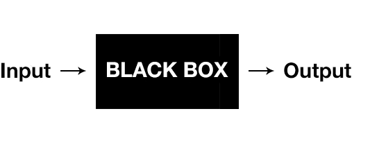

# Reading Material JavaScript1 Week 3

## Agenda

These are the topics for week 3:

1. Functions
2. Thinking like a programmer I
3. How JavaScript relates to HTML & CSS

## 1. Functions

In programming, we often use code to perform a specific task multiple times. Instead of rewriting the same code, we can group a block of code together and associate it with one task. This is useful, because then we can reuse that block of code whenever we need to perform the task again.

In JavaScript, we call these blocks of code `functions`. They are written like this:

```js
function multiplyTwoNumbers(number1, number2) {
  return number1 * number2;
}
```

This is also called a `function definition`.

In the example, the word `function` is a keyword, that indicates that what will follow is a function. The word `multiplyTwoNumbers` is the name of the function, that will be referred to when the function needs to be executed.

> Note: This is a common pattern you'll find across different programming languages. It's usually necessary to specify what type of data you are going to create, before creating it. This is necessary because they computer cannot guess how they should treat any piece of information. It would the same as, before you ask a question to someone, you would say: QUESTION, what is a function? Saying QUESTION before you ask a question informs the interpreting party (i.e. the person you're talking to) that what you just said is a question. In human communication that's usually not necessary, but it is when communicating with computers.

The words `number1` and `number2` are called `parameters`: they work as a temporary placeholder that will be replaced with real data. You can liken it to how in a restaurant a table is reserved for customers. The moment the customers arrive the placeholders will be removed and the seats will be filled by the actual customers. The moment a function is given an input, the parameters are called `arguments`: the real information given to the function is called an argument.

When used in software, a function is like a black box that:

1. Receives an input
2. Performs an operation on the input (inside the box)
3. and lastly, produces an output.



A function is used as follows:

```js
multiplyTwoNumbers(2, 4);
```

You refer to the function name, give it arguments (which are either supplied by some other code or created on the spot) and get back an output. The output is also called the `return value`, the information you get after the `return` keyword.

As a developer you either use pre-defined functions or create your own in order to make certain tasks happen. Within a function block (which is everything between the `{ }`, there are instructions that tell it in what ways it should manipulate and change the input in order to produce a desired output.

You should see it like this: a function is like a `tool` in the tool box. Only, instead of a hammer or a screwdriver you have a function that multiplies two numbers, or a function that transform data from one data type to another.

Go over the following materials to learn more about the how and why of functions:

- [What is a function in programming?](https://www.youtube.com/watch?v=QcCnfAxGpgg)
- [JavaScript Functions](https://www.youtube.com/watch?v=R8SjM4DKK80)
- [Functions](https://github.com/HackYourFuture/fundamentals/blob/master/fundamentals/functions.md)

## 2. Thinking like a programmer I

During these past weeks you have gotten a taste of what programming is: the various concepts, what it looks like in code and the way it's used. However, having written some code doesn't make you a programmer. Thinking like a programmer makes you into a programmer. But what does that mean, 'thinking like a programmer'?

Thinking like a programmer is very similar to thinking like a construction worker:

1. You have to build something and it's up to you to know all the necessary tools and techniques to make that happen, and
2. You have to solve every problem that comes up along the way (such as things that go wrong, knowing how to choose the right tools for the job and striving to achieve the right goal)

The second skill, problem solving, is the most important one. If you get good at that, you'll automatically get good at the first.

Take a look at the following resources to learn more about problem solving as applied to programming:

- [How to THINK like a programmer](https://www.youtube.com/watch?v=NNazO2tMHno)
- [Lessons in problem solving](https://www.freecodecamp.org/news/how-to-think-like-a-programmer-lessons-in-problem-solving-d1d8bf1de7d2/)
- [Computational thinking](https://www.youtube.com/watch?v=qbnTZCj0ugI)

## 3. How JavaScript relates to HTML & CSS

Consider the following analogy. The human body needs 3 essential parts in order to function appropriately: bones, skin and muscles. The bones are necessary to give the body **structure**. The skin (shape of body, hair, clothing, make up) is necessary to give the body a unique **presentation**. and the muscles (for walking, climbing, swimming) are needed to give the body **movement and interactivity**.

This is exactly how HTML, CSS and JavaScript relate to each other:

- HTML is used to put the structure of a website together
- CSS acts like the skin and makeup for the HTML. CSS improves the colors and layout of a website structure built with HTML
- JavaScript is a full-on programming language that adds interactivity and functionality to a website

Check the following article to learn more about this:

- [The Relationship Between HTML, CSS and JavaScript Explained by Building A City](https://blog.codeanalogies.com/2018/05/09/the-relationship-between-html-css-and-javascript-explained/)

## Finished?

Are you finished with going through the materials? Give yourself a pat on the back because you rock! When you feel ready to get practical, click [here](./MAKEME.md).
