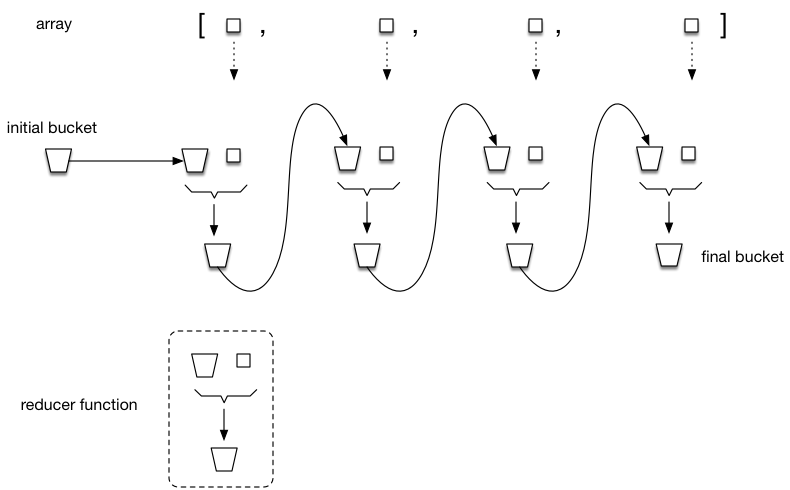

# REVIEW JavaScript week 7

## Git Workflow

To be provided

## Map, filter, reduce 

The array methods **map()**, **filter()** and **reduce()** are best understood by looking at how they could be implemented if we were to write them ourselves. In the next few sections we will present simplified versions of the native implementations. We have prefixed the method names with `my` to distinguish them from the built-in versions.

### Array#map\*

The **map** method returns a new array where each element of the subject array is transformed by a user-supplied transformation (= _mapping_) function. 

```js
Array.prototype.myMap = function (mapFn) {
  const arr = [];
  for (let i = 0; i < this.length; i++) {
    arr.push(mapFn(this[i], i, this));
  }
  return arr;
};
```

<small>\* Array#map is a short-hand notation for Array.prototype.map.</small>

As you can see, the `mapFn` function is called with three arguments:

1. the current array element to be transformed
2. the index of the element (starting with `0`)
3. the subject array itself

As is usual in JavaScript you do not necessarily have to use all the parameters that were passed to the `mapFn` function. In fact, in many cases you will only need the first argument (the current array element).

In the example below we will use the Array#map method to compute the squares of an array of numbers.

```js
const numbers = [3, 5, 2, 7];
const squares = numbers.map(num => num * num);
console.log(squares); // -> [9, 25, 4, 49]
```

### Array#filter

The **filter()** method returns a new array with all elements that pass the test implemented by a user-supplied (predicate\*) function. 

```js
Array.prototype.myFilter = function (predicateFn) {
  const arr = [];
  for (let i = 0; i < this.length; i++) {
    if (predicateFn(this[i], i, this)) {
      arr.push(this[i]);
    }
  }
  return arr;
};
```

<small>\*A predicate is a function that returns a boolean, whose value depends on its supplied arguments.</small>

Example:

```js
const numbers= [6, 3 , 10, 1];
const evenNumbers = numbers.filter(num => num % 2 === 0);
console.log(evenNumbers); // -> [6, 10]
```

### Array#reduce

Of the three methods **map**, **filter** and **reduce**, the **reduce** method presents the most difficulty for new learners. The _Mozilla Developer Network_ (MDN) web site gives the following definition:

> The reduce() method applies a function against an accumulator and each element in the array (from left to right) to reduce it to a single value\*\*.

<small>\*\*Although reference is made to a 'single value', this single value may well be an array or an object, as you will see later in the examples below.</small>

```js
Array.prototype.myReduce = function (reducerFn, initialValue) {
  let accumulator = initialValue;
  for (let i = 0; i < this.length; i++) {
    accumulator = reducerFn(accumulator, this[i], i, this);
  }
  return accumulator;
};
```

The whole process is visualised in the figure below (the term _bucket_ was used here to represent the accumulator).



The **reduce()** method is the most flexible of the map/filter/reduce triplet. In fact, it is possible to rewrite **map()** and **filter** using **reduce()**. 

#### Using reduce() to filter

```js
const arr = [6, 3, 10, 1];
const evenNumbers = arr.reduce((acc, elem) => {
  if (elem % 2 === 0) {
    acc.push(elem);
  }
  return acc;
}, []);
console.log(evenNumbers); // -> [6, 10]
```

In this example our accumulator is an (initially empty) array. We put elements (in this case integer numbers) in the accumulator only when they are divisible by 2.

#### Using reduce() to map

In this example an array of integer numbers is mapped to an array of their squares.

```js
const arr = [6, 3, 10, 1];
const squares = arr.reduce((acc, elem) => {
  acc.push(elem * elem);
  return acc;
}, []);
console.log(squares); // -> [36, 9, 100, 1]
```

### Using reduce() to 'group by'

In this example our accumulator is not an array, but an (initially empty) object. It groups the array elements by gender.

```js
const arr = [
  { gender: 'F', name: 'Joyce'},
  { gender: 'M', name: 'Jim' },
  { gender: 'F', name: 'Lucy' },
  { gender: 'M', name: 'Ferdinand' }
];
const groupedNames = arr.myReduce((acc, elem) => {
  if (acc[elem.gender]) {
    acc[elem.gender].push(elem);
  } else {
    acc[elem.gender] = [elem];
  }
  return acc;
}, {});
console.log(groupedNames);
```

Result:

```js
{
  F: [
    { gender: 'F', name: 'Joyce' },
    { gender: 'F', name: 'Lucy' }
  ],
  M: [
    { gender: 'M', name: 'Jim' },
    { gender: 'M', name: 'Ferdinand' }
  ]
}
```

### Method chaining

The methods **map()**, **filter()** and **reduce()** each return a new array. This makes it possible to chain these methods and create a 'pipeline' of operations, to be applied in sequence. Let's take the last example, but now filtering out only those array elements for which the name starts with a 'J':

```js
const arr = [
  { gender: 'F', name: 'Joyce' },
  { gender: 'M', name: 'Jim' },
  { gender: 'F', name: 'Lucy' },
  { gender: 'M', name: 'Ferdinand' }
];
const groupedNames = arr
  .filter(elem => elem.name.startsWith('J'))
  .reduce((acc, elem) => {
    if (acc[elem.gender]) {
      acc[elem.gender].push(elem);
    } else {
      acc[elem.gender] = [elem];
    }
    return acc;
  }, {});
console.log(groupedNames);
```

Result:

```js
{
  F: [{ gender: 'F', name: 'Joyce' }],
  M: [{ gender: 'M', name: 'Jim' }]
}
```

## In summary


Credit: http://www.globalnerdy.com/2016/06/23/map-filter-and-reduce-explained-using-emoji/

