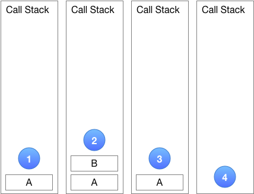
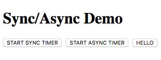
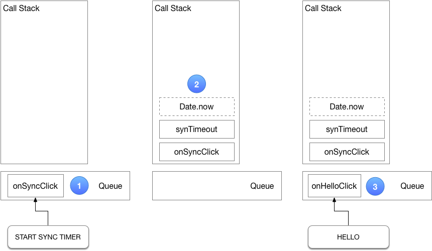
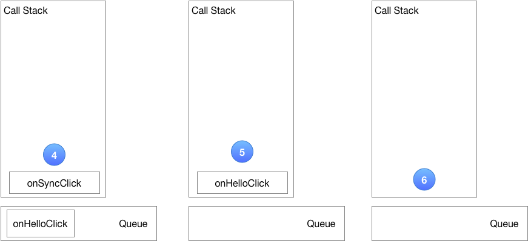
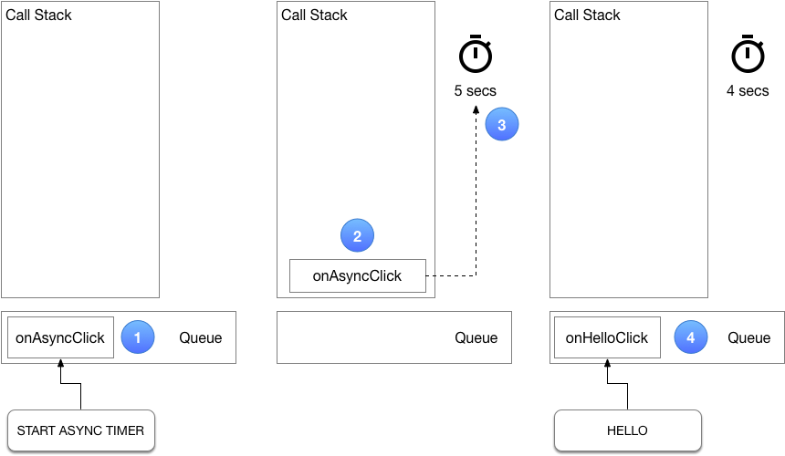
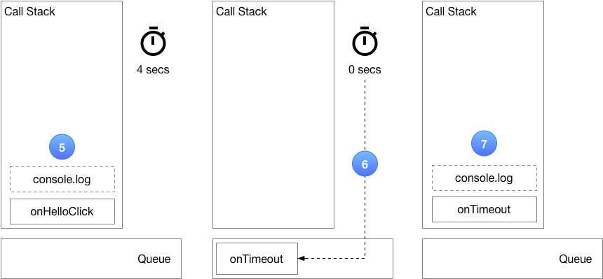
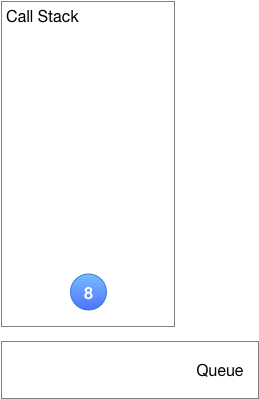

# Event Loop

## YouTube Video

This article is a companion to the excellent YouTube video [What the heck is the event loop anyway?](https://www.youtube.com/watch?v=8aGhZQkoFbQ) by Philip Roberts.

[](https://www.youtube.com/watch?v=8aGhZQkoFbQ "Event Loop")

## Introduction

The way of programming when developing JavaScript applications for the browser is sometimes called _Event-Driven Programming_. Once a JavaScript program has been loaded in the browser and has completed its initialization, it is normally waiting for specific "events" to happen. These events can take the form of mouse movements and clicks, keyboard interactions and network-related events (e.g. a response from an `XMLHttpRequest`)*.

In order for a JavaScript program to respond to a specific (type of) event, a programmer needs to add an "event listener" for the event type of interest to the target DOM element or network request object.

Event examples are:

- a `'click'` event from an HTML button element.
- a `'load'` event from an XMLHttpRequest.

A JavaScript program can also set up one or more timers and execute a function when a specific timeout expires. One could consider these to be  _software-initiated_ events.

When a event occurs, the browser places an object with information about the event along with the JavaScript function designated to handle the event in an Event Queue. When the JavaScript engine is idle (i.e. when the call stack is empty, see below), it picks up the next event from the Event Queue and invokes the corresponding event handler, passing the event object as a parameter. This mechanism could be depicted by the follow pseudo-code:

```
// Event Loop
while (waiting_for_event) {
  execute_event_handler(event)
}
```


\* Note: There are more [Web APIs](https://developer.mozilla.org/en-US/docs/Web/API) available in the browser that could potentially generate events, e.g. the [SpeechSynthesis API](https://developer.mozilla.org/en-US/docs/Web/API/SpeechSynthesis) and the [MIDIAccess API](https://developer.mozilla.org/en-US/docs/Web/API/MIDIAccess), to name just two.

## Call Stack

The JavaScript engine maintains a [call stack](https://developer.mozilla.org/en-US/docs/Glossary/Call_stack) to keep track of nested function calls. (The call stack is similar to a JavaScript array to which items are pushed and from which items are popped.)

Figure 1 below depicts the call stack for a scenario where function **A**() calls function **B**(). The currently executing function is always the one at the top of the call stack. In this case, execution starts with function **A**().

1. The JavaScript engine pushes **A**() on the call stack and starts its execution.
2. Function **A**() calls function **B()**: the JavaScript engine suspends the execution of **A**() (taking note where it left off), pushes **B**() on the call stack and starts executing **B**().
3. When function **B**() returns, the JavaScript engine pops **B**() off the stack. Since function **A**() is now again at the top the stack, the JavaScript engine resumes **A**() at the point where it left off.
4. Finally, when function **A**() returns it is popped of the stack and with the call stack now empty, the JavaScript engine enters its event loop. 



Figure 1. Call Stack

## Example Code

We will use the example application below for our discussion of the event loop. The application consist of a simple HTML page with three buttons and an associated JavaScript file. The web page looks like this:



All output resulting from button clicks will be printed in the browser's console.

### index.html

```html
<!DOCTYPE html>
<html>
<head>
  <title>Sync/Async Demo</title>
  <style>
    button {
      margin-right: 4px;
    }
  </style>
</head>
<body>
  <div>
    <h1>Sync/Async Demo</h1>
    <button id="btn-sync">START SYNC TIMER</button>
    <button id="btn-async">START ASYNC TIMER</button>
    <button id="btn-hello">HELLO</button>
  </div>
  <script src="app.js"></script>
</body>
</html>
```

### app.js

The JavaScript file `app.js` adds a `'click'` event listener for each of the three buttons. Rather than using anonymous functions for the event handlers, all functions are given a name so that these names show up in the call stack should we run this code in the Chrome debugger.

```js
'use strict';
'use strict';
{
  function synTimeout(delay) {
    const stopTime = Date.now() + delay;
    while (Date.now() < stopTime);
  }

  function addSyncOnClickListener() {
    document
      .getElementById('btn-sync')
      .addEventListener('click', function onSyncClick() {
        console.log('start sync timer');
        synTimeout(5000);
        console.log('stop sync timer');
      });
  }

  function addAsyncOnClickListener() {
    document
      .getElementById('btn-async')
      .addEventListener('click', function onAsyncClick() {
        console.log('start async timer');
        setTimeout(function onTimeout() {
          console.log('stop async timer');
        }, 5000);
      });
  }

  function addHelloOnClickListener() {
    document
      .getElementById('btn-hello')
      .addEventListener('click', function onHelloClick() {
        console.log('Hello, world!');
      });
  }

  window.onload = () => {
    addSyncOnClickListener();
    addAsyncOnClickListener();
    addHelloOnClickListener();
  };
}
```

### Synchronous, blocking code

In Figure 2.1 below, when the **START SYNC TIMER** button is clicked ①, a `click` event with its `onSyncClick` event handler is placed in the Event Queue and, because the call stack is empty, is immediately executed. The `onSyncClick` function calls the `synTimeout` function, passing the desired time delay in milliseconds in the `delay` parameter. The call stack at this point in time is depicted in ②.

The `synTimeout` function keeps racing around in a tight `while` loop, in each loop iteration calling `Date.now()` to check whether the specified delay has already been reached. While the JavaScript engine is busy executing this `while` loop, it cannot run any other code. In particular, it cannot pick up events from the Event Queue, for instance click events from the **HELLO** button, while the loop is executing ③. The `onHelloClick` event handler awaits execution in the Event Queue (with the browser appearing to be unresponsive) until the `synTimeout` function completes, and with it, the `onSyncClick` function (Figure 2.2, ④). 



Figure 2.1 The Event Loop - blocking code.

At this point the call stack becomes empty, and the event loop can pick up `onHelloClick` from the Event Queue and execute it ⑤. In the browser this is experienced as a delayed, sluggish response to the click on the **HELLO** button.

Finally, when the `onHelloClick` event handler has finished execution, the call stack becomes empty again ⑥, and the event loop awaits further, future events.

**In conclusion:** Synchronous, blocking code, such as implemented by 
the `synTimeout` function is to be avoided as it makes the application appear to be unresponsive.



Figure 2.2 The Event Loop - blocking code - continued.

## Asynchronous, non-blocking code

In contrast, in Figure 3.1, when we click the **START ASYNC TIMER** button ①, the `onAsyncClick` event handler is placed and the Event Queue and, because the call stack is empty, is immediately executed ②. It in turn calls the `setTimeout` function provided by the browser (**not** the JavaScript engine!). This starts a timer internal to the browser ③. Once the timer has been set up the `setTimeout` function returns and subsequently the `onAsyncClick` event handler exits. 

Suppose that one second later we click the **HELLO** button ④. This causes the `onHelloClick` event handler to be placed in the Event Queue. Because the call stack is empty the `onHelloClick` event handler is immediately executed ⑤ and subsequently exits.



Figure 3.1 The Event Loop - non-blocking code.


When some time later the timer set up in step 3 expires, the `onTimeout` callback is placed in the event queue ⑥. Again, because the call stack is empty at that point in time it is immediately executed ⑦.



Figure 3.2 The Event Loop - non-blocking code - continued.

Subsequently it exits, leaving the call stack empty again ⑧, ready to take on new events from the event loop whenever they occur.



Figure 3.3 The Event Loop - non-blocking code - continued.

**In conclusion:** Asynchronous, non-blocking code is to be preferred at all times to ensure that the application maintains its responsiveness.

## More Information

Mozilla Developer Network: [Concurrency model and Event Loop](https://developer.mozilla.org/en-US/docs/Web/JavaScript/EventLoop)