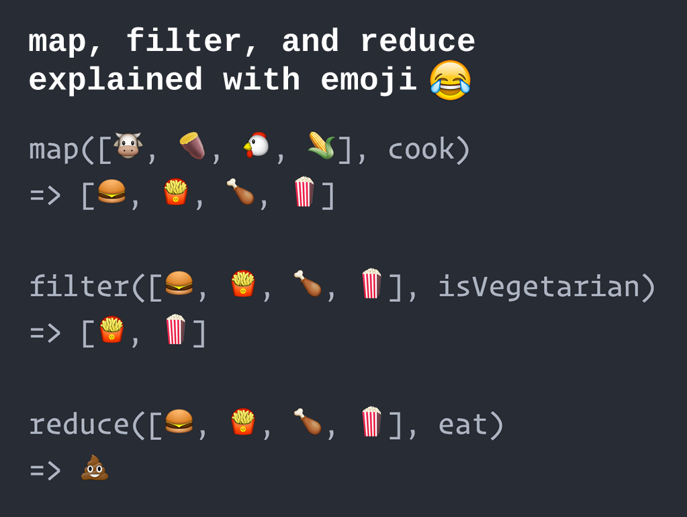

# Map, filter

The array methods **map()** and **filter()** are best understood by looking at how they could be implemented if we were to write them ourselves. In the next few sections we will present simplified versions of the native implementations. We have prefixed the method names with `my` to distinguish them from the built-in versions.

Each of the three methods use a `for` loop internally. You will notice that once you start using these methods the need for `for` loops in your own code is greatly reduced (hurray!).

## Array#map()\*

The **map** method returns a new array where each element of the subject array is transformed by a user-supplied transformation (= _mapping_) function.

```js
Array.prototype.myMap = function (mapFn) {
  const arr = [];
  for (let i = 0; i < this.length; i++) {
    arr.push(mapFn(this[i], i, this));
  }
  return arr;
};
```

<small>\* Array#map is a short-hand notation for Array.prototype.map.</small>

Because the **map()** method is called on an array (using dot-notation), the value of `this` refers to that array itself (in this review called the _subject_ array).

Internally, the **map()** method initializes a new, empty array to which it will push transformed elements, one by one, as it iterates through the subject array, calling the `mapFn` function for each individual element. When the loop has been completed, the new array is returned. Note that the subject array itself remains unmodified.

`this[i]` refers to an element of the subject array at loop index 'i' (because `this` is a reference to the subject array).

As you can see, the `mapFn` function is called with three arguments:

1. the current array element to be transformed
2. the index of the element (starting with `0`)
3. the subject array itself

In the example below we will use the Array#map method to create a new array that holds the squares of a subject array of numbers. The mapping function is represented by an ES6 fat arrow function:<br>`num => num * num`

```js
const numbers = [3, 5, 2, 7];
const squares = numbers.map(num => num * num);
console.log(squares); // -> [9, 25, 4, 49]
```

For illustrative purposes we can add a `console.log`<sup>†</sup> statement to our mapping function and see what we get passed as second and third argument:

```js
const numbers = [3, 5, 2, 7];
const mapFn = (num, index, arr) => {
  console.log(num, index, arr);
  return num * num;
}
const squares = numbers.map(mapFn);
console.log('squares', squares)
```

Output:

```js
3 0 [ 3, 5, 2, 7 ]
5 1 [ 3, 5, 2, 7 ]
2 2 [ 3, 5, 2, 7 ]
7 3 [ 3, 5, 2, 7 ]
squares [ 9, 25, 4, 49 ]
```

For each of the first four lines in the output (from the `console.log` inside the `for` loop) the first number is the value of the current element, the second number is the current loop index value and the array value is the original subject array.

As is usual in JavaScript you do not necessarily have to use all the parameters that were passed to the `mapFn` function. In fact, in many cases you will only need the first argument (the current array element) as we saw in the first example.

<sup>†</sup>You should normally not use `console.log` inside the function you pass to the `map` (or `filter`) method. These functions should also **not modify** any variables outside their own function scope, although they can reference these variables for read-only purposes. In computer science terms, these functions should be [pure with no 'side-effects'](https://medium.com/javascript-scene/master-the-javascript-interview-what-is-a-pure-function-d1c076bec976).

## Array#filter()

The **filter()** method returns a new array with all elements that pass the test implemented by a user-supplied (predicate\*) function.

```js
Array.prototype.myFilter = function (predicateFn) {
  const arr = [];
  for (let i = 0; i < this.length; i++) {
    if (predicateFn(this[i], i, this)) {
      arr.push(this[i]);
    }
  }
  return arr;
};
```

<small>\*A predicate is a function that returns a boolean, whose value depends on its supplied arguments.</small>

This method works in a similar fashion as the **map()** method, but now elements are only pushed to the new array if the predicate function returns `true`.

In the example below the predicate function test whether the current element is even by checking whether its value divided by two has a remainder of zero. The result of this comparison (`true` or `false`) is the return value of the predicate and determines whether the current element gets added to the new array or not.

```js
const numbers= [6, 3 , 10, 1];
const evenNumbers = numbers.filter(num => num % 2 === 0);
console.log(evenNumbers); // -> [6, 10]
```

## Bonus: Array#reduce()

Of the three methods **map**, **filter** and **reduce**, the **reduce** method presents the most difficulty for new learners. At present the **reduce** method is not covered in the HackYourFuture curriculum, nor required in the homework. It is nevertheless included in here for completeness.

The _Mozilla Developer Network_ (MDN) web site gives the following definition:

> The reduce() method applies a function against an accumulator and each element in the array (from left to right) to reduce it to a single value\*\*.

<small>\*\*Although reference is made to a 'single value', this single value may well be an array or an object, as you will see later in the examples below.</small>

```js
Array.prototype.myReduce = function (reducerFn, initialValue) {
  let accumulator = initialValue;
  for (let i = 0; i < this.length; i++) {
    accumulator = reducerFn(accumulator, this[i], i, this);
  }
  return accumulator;
};
```

The key to understanding the **reduce()** method is in the line:

```js
accumulator = reducerFn(accumulator, this[i], i, this);
```

In the case we don't need the current loop index and the subject array in the reducer function (which is often the case), we can simplify this to:

```js
accumulator = reducerFn(accumulator, this[i]);
```

From this line we can define the reducer function as a function that takes an accumulator value and the current array element and returns a new accumulator value.

The **reduce()** method is the most flexible of the map/filter/reduce triplet. In fact, it is possible to rewrite **map()** and **filter** using **reduce()**.

### Using reduce() to filter

```js
const arr = [6, 3, 10, 1];
const evenNumbers = arr.reduce((acc, elem) => {
  if (elem % 2 === 0) {
    acc.push(elem);
  }
  return acc;
}, []);
console.log(evenNumbers); // -> [6, 10]
```

In this example our accumulator is an (initially empty) array. We put elements (in this case integer numbers) in the accumulator only when they are divisible by 2.

### Using reduce() to map

In this example an array of integer numbers is mapped to an array of their squares.

```js
const arr = [6, 3, 10, 1];
const squares = arr.reduce((acc, elem) => {
  acc.push(elem * elem);
  return acc;
}, []);
console.log(squares); // -> [36, 9, 100, 1]
```

## Using reduce() to 'group by'

In this example our accumulator is not an array, but an (initially empty) object. It groups the array elements by gender.

```js
const arr = [
  { gender: 'F', name: 'Joyce'},
  { gender: 'M', name: 'Jim' },
  { gender: 'F', name: 'Lucy' },
  { gender: 'M', name: 'Ferdinand' }
];
const groupedNames = arr.reduce((acc, elem) => {
  if (acc[elem.gender]) {
    acc[elem.gender].push(elem);
  } else {
    acc[elem.gender] = [elem];
  }
  return acc;
}, {});
console.log(groupedNames);
```

Result:

```js
{
  F: [
    { gender: 'F', name: 'Joyce' },
    { gender: 'F', name: 'Lucy' }
  ],
  M: [
    { gender: 'M', name: 'Jim' },
    { gender: 'M', name: 'Ferdinand' }
  ]
}
```

### Method chaining

The methods **map()**, **filter()** and **reduce()** each return a new array. This makes it possible to chain these methods and create a 'pipeline' of operations, to be applied in sequence. Let's take the last example, but now filtering out only those array elements for which the name starts with a 'J':

```js
const arr = [
  { gender: 'F', name: 'Joyce' },
  { gender: 'M', name: 'Jim' },
  { gender: 'F', name: 'Lucy' },
  { gender: 'M', name: 'Ferdinand' }
];
const groupedNames = arr
  .filter(elem => elem.name.startsWith('J'))
  .reduce((acc, elem) => {
    if (acc[elem.gender]) {
      acc[elem.gender].push(elem);
    } else {
      acc[elem.gender] = [elem];
    }
    return acc;
  }, {});
console.log(groupedNames);
```

Result:

```js
{
  F: [{ gender: 'F', name: 'Joyce' }],
  M: [{ gender: 'M', name: 'Jim' }]
}
```

## In summary



Credit: http://www.globalnerdy.com/2016/06/23/map-filter-and-reduce-explained-using-emoji/

