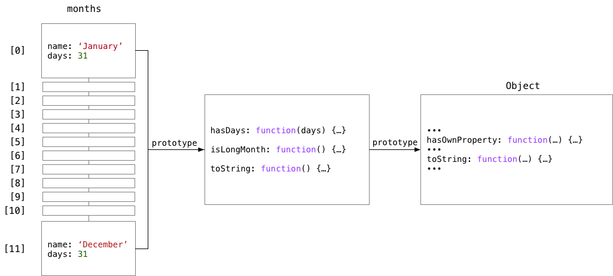

# Object-Oriented Programming & Classes

### Object Literals and Imperative Programming

In earlier JavaScript lectures we saw that we can create objects through object literals and use functions to access and manipulate their properties. A typical example is shown below, where we have defined an array of objects, in this case each representing the name of a month and its associated number of days.

We're looping through the months and printing an informational message to the console for each month having 31 days.

This style of programming is called Imperative Programming: in the code detail containing the `for` loop we instruct the computer _how to perform the task(s) at hand_.

```js
const months = [
  { name: 'January', days: 31 },
  { name: 'February', days: 28 },
  { name: 'March', days: 31 },
  { name: 'April', days: 30 },
  { name: 'May', days: 31 },
  { name: 'June', days: 30 },
  { name: 'July', days: 31 },
  { name: 'August', days: 31 },
  { name: 'September', days: 30 },
  { name: 'October', days: 31 },
  { name: 'November', days: 30 },
  { name: 'December', days: 31 }
];

for (const month of months) {
  if (month.days === 31) {
    console.log(`${month.name} has ${month.days} days.`);
  }
}
```

## Functional Programming

In the Functional Programming style (also referred to as Declarative Programming), we prefer to declare _what the computer should do_.

In the next example we have used the `filter` method to extract a subset of months having 31 days, used the `map` method to create an informational string for each month and a `forEach` method to output those strings to the console.

Put in other words, we state or **declare** that the computer should **filter** our array according to some predefined criterion, then **map** each filtered object to a string and print out each string to the console.

> A prime example of a declarative language is SQL, which you will learn in the HYF Database module.

In contrast to the Imperative Style we do not have to infer from looking at the code what is actually happening. Instead, the names of the functions and methods already indicate what it is we want to achieve.

```js
const months = [
  { name: 'January', days: 31 },
  { name: 'February', days: 28 },
  { name: 'March', days: 31 },
  { name: 'April', days: 30 },
  { name: 'May', days: 31 },
  { name: 'June', days: 30 },
  { name: 'July', days: 31 },
  { name: 'August', days: 31 },
  { name: 'September', days: 30 },
  { name: 'October', days: 31 },
  { name: 'November', days: 30 },
  { name: 'December', days: 31 }
];

months
  .filter(month => month.days === 31)
  .map(month => `${month.name} has ${month.days} days.`)
  .forEach(string => console.log(string));
```

### Constructor Functions (pre-ES6) and the `new` keyword

In the example below we use a function that is used in conjunction with the `new` keyword. Such a function is called a **constructor** function, and, by convention, we start its name with an uppercase letter.

When a function is called and preceded by the `new` keyword, something special happens. The JavaScript engine creates a new, empty object and assigns that object to the `this` variable.

> The `this` variable is always present in JavaScript. Its value is dependent on the current execution context. Most of the time, the value of `this` is `undefined`. However, when calling a method on an object, the `this` variable holds a reference to the object it is called on. We can use the `this` variable inside the method implementation to get at other properties and methods within the object.

We can now add properties to the new object through the `this` variable, as shown below.

When the constructor function finishes, it returns the newly constructed object as its return value.

```js
function Month(name, days) {
  this.name = name;
  this.days = days;
}

const months = [
  new Month('January', 31),
  new Month('February', 28),
  new Month('March', 31),
  new Month('April', 30),
  new Month('May', 31),
  new Month('June', 30),
  new Month('July', 31),
  new Month('August', 31),
  new Month('September', 30),
  new Month('October', 31),
  new Month('November', 30),
  new Month('December', 31)
];

months
  .filter(month => month.days === 31)
  .map(month => `${month.name} has ${month.days} days.`)
  .forEach(string => console.log(string));
```

- [Understanding JavaScript Function Invocation and "this"](http://yehudakatz.com/2011/08/11/understanding-javascript-function-invocation-and-this/), by Yehuda Katz.

- StackOverflow: [What is the 'new' keyword in JavaScript?](https://stackoverflow.com/questions/1646698/what-is-the-new-keyword-in-javascript)

### Introducing Object-Oriented Programming

In the preceding example, there was not much to be gained from using a constructor function in conjunction with the `new` keyword, as compared to just using object literals. The advantages become more clear when we start to add **methods** to the object. Methods are just plain JavaScript functions that you call on an object, using dot notation. In the code snippet below, we have defined a couple of functions and assigned them to object properties through the `this` variable in the constructor function. This makes these functions into methods.

```js
function Month(name, days) {
  this.name = name;
  this.days = days;

  this.hasDays = function (days) {
    return this.days === days;
  };

  this.isLongMonth = function () {
    return this.hasDays(31);
  };

  this.toString = function () {
    return `${this.name} has ${this.days} days.`;
  };

  this.toConsole = function () {
    console.log(this.toString());
  };
}

const months = [
  new Month('January', 31),
  new Month('February', 28),
  new Month('March', 31),
  new Month('April', 30),
  new Month('May', 31),
  new Month('June', 30),
  new Month('July', 31),
  new Month('August', 31),
  new Month('September', 30),
  new Month('October', 31),
  new Month('November', 30),
  new Month('December', 31)
];

months
  .filter(month => month.isLongMonth())
  .forEach(month => month.toConsole());
```

We can now call these methods using dot notation, as in:

```js
month.isLongMonth()
month.toConsole()
```

We have already seen this notation when we used, for instance, `map` and `filter`.

When we add methods to an object to operate on data contained in the object, we have created a more or less self-contained object. The object knows how to operate its data and external code need not know anything about its internals. This concept is known as Object-Oriented Programming. It is the default style of programming in object-oriented languages such as Java, C# and C++. In JavaScript it is optional. In the HYF React module, ES6 classes are used extensively.

### Prototypes

The code from the previous example has a significant inefficiency: each object get its own copy of the methods (`hasDays` etc). This takes up unnecessary memory. It would be far better if the objects could share a common set of methods. This is where JavaScript's concept of a `prototype` comes in.

Each JavaScript function has a `prototype` property that points to an, initially empty, prototype object. It only comes into play when using that function as a **constructor** function. We can assign functions to this prototype which are shared by all objects we create through calling the constructor function in combination with the `new` keyword. 

```js
function Month(name, days) {
  this.name = name;
  this.days = days;
}

Month.prototype.hasDays = function (days) {
  return this.days === days;
};

Month.prototype.isLongMonth = function () {
  return this.hasDays(31);
};

Month.prototype.toString = function () {
  return `${this.name} has ${this.days} days.`;
};

Month.prototype.toConsole = function () {
  console.log(this.toString());
}

const months = [
  new Month('January', 31),
  new Month('February', 28),
  new Month('March', 31),
  new Month('April', 30),
  new Month('May', 31),
  new Month('June', 30),
  new Month('July', 31),
  new Month('August', 31),
  new Month('September', 30),
  new Month('October', 31),
  new Month('November', 30),
  new Month('December', 31)
];

months
  .filter(month => month.isLongMonth())
  .forEach(month => month.toConsole());
```


The diagram below depicts how this sharing works out. At this time it is not necessary that you understand every detail. Just note how there is a single copy of functions, shared by all instances of the `Months` objects.



### ES6 Classes

In ES6 a new way of defining objects and its methods was introduced. It uses the same `prototype` mechanism behind the scenes, but its syntax is closer to that of other object-oriented languages, such as Java, etc. Because it is only new syntax, hiding the intricacies of the `prototype`, it is often designated as 'syntactic sugaring'.

In ES6 classes we use the `class` keyword to define a class. The `constructor` method takes the place of the constructor function of the previous examples.

We define methods by creating functions inside the class body, however without the `function` keyword. As previously, the `this` keyword refers to the object that a method is called upon.

```js
class Month {
  constructor(name, days) {
    this.name = name;
    this.days = days;
  }

  hasDays(days) {
    return this.days === days;
  }

  isLongMonth() {
    return this.hasDays(31);
  }

  toString() {
    return `${this.name} has ${this.days} days.`;
  }

  toConsole() {
    console.log(this.toString());
  }
}

const months = [
  new Month('January', 31),
  new Month('February', 28),
  new Month('March', 31),
  new Month('April', 30),
  new Month('May', 31),
  new Month('June', 30),
  new Month('July', 31),
  new Month('August', 31),
  new Month('September', 30),
  new Month('October', 31),
  new Month('November', 30),
  new Month('December', 31)
];

months
  .filter(month => month.isLongMonth())
  .forEach(month => month.toConsole());
```


### Bonus: Array.prototype.map & Array.prototype.filter Implementations

Now that we know a bit more about objects, prototypes and the `this` variable, it might be useful to revisit the `map` and `filter` methods we used before and examine how they might be implemented internally.

In the examples below, we have defined alternative implementations for `map` and `filter` and named them `myMap` and `myFilter`. If we run this code we are actually adding these methods to the existing `Array` constructor function (in general, it is a bad idea to modify standard JavaScript objects, but we use it here for illustrative purposes).

The `this` variable inside the method implementations refer to the array (which is technically an object: `typeof arr === 'object'`) on which the method is called.

As you can see, both methods use a `for` loop internally, saving us the trouble of writing a `for` loop ourselves. Both methods call a callback that was passed as a parameter. The callback, in its turn, is called for every loop iteration with three parameters, viz:

1. The current array element
2. The current loop index value
3. The complete array itself

For the `map` method, the value that we return from our callback is pushed onto a new, initially empty array.

For the `filter` method, the current element is pushed unmodified to a new, initially empty array if, and only if our callback returns a 'truthy' value.

Finally, both methods return the newly constructed array as their return value.

```js
Array.prototype.myMap = function (callback) {
  const arr = [];
  for (let i = 0; i < this.length; i++) {
    arr.push(callback(this[i], i, this));
  }
  return arr;
};
```


```js
Array.prototype.myFilter = function (callback) {
  const arr = [];
  for (let i = 0; i < this.length; i++) {
    if (callback(this[i], i, this)) {
      arr.push(this[i]);
    }
  }
  return arr;
};
```