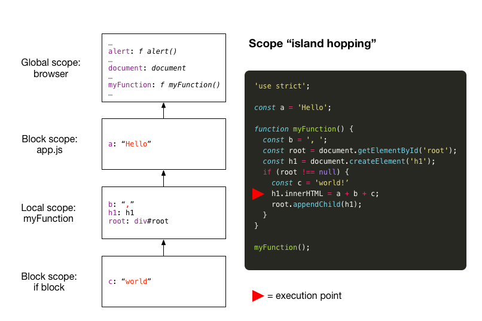

# Scope

## What is scope?

Definition from [Dictionary.com](http://www.dictionary.com/browse/scope):

> noun
1\. extent or range of view, outlook, application, operation, effectiveness, etc.:

If you imagine yourself as the computer that is executing your JavaScript code, you can think of scope as meaning:

> what you can see from where you are 

In this case the 'things' that you are looking for are variables and functions. When we say, "What's in scope?", we mean "Which variables and functions can be accessed from the current point of execution in your code?" As it happens, in JavaScript there are three types of scope to consider.

## Global scope

Variables and functions defined at global scope are visible from any point of execution in your code. Sometimes that's a good thing (or even essential), but in general you must avoid creating variables and functions in global scope unless you have specific reasons to do so.

Consider the example below:

```js
a = 'Hello'; // don't do this
console.log(a);
```

In this example we have assigned the value `'Hello'` to a variable that we forgot to declare (we forgot to use `let`, `const` or `var`). The JavaScript engine tries to be helpful and defines a variable `a` for us in **global** scope. More recently, the JavaScript community considered this friendliness to be a mistake and with ES5 introduced `strict` mode: place the string `'use strict';` at the top of your file. This now causes our code to fail with a run-time error when forgetting to 'declare' our variables.

```js
'use strict';
a = 'Hello'; // produces: ReferenceError: a is not defined
console.log(a);
```

You can correct this by declaring your variable with `let`, `const` or `var`:

```js
'use strict';
var a = 'Hello';
console.log(a);
```

This still puts the variable `a` into the global scope. So why is global scope a problem? Because you cannot be sure that the variable names you choose do not conflict with names already present in global scope (global scope is a busy place).

It is best to apply the principle of 'need to know'. Only expose your variables to other parts in the JavaScript ecosystem that need to know about them. This is where local scope and block scope come in.

## Local scope

When you declare a function in JavaScript the function body represents a new, local scope, distinct from global scope. Variables defined in the function body are visible in that function body only: from the outside, you can't look in.

```js
'use strict';

function myFunction() {
  const a = 'Hello';
  console.log(a);
}

myFunction();

// console.log(a); <= this would produce: ReferenceError: a is not defined
```

But from the inside you can look out. In the example below the variable `a` is visible from inside the function body.

```js
'use strict';

const a = 'Hello';

function myFunction() {
  const b = ', world';
  console.log(a + b);
}

myFunction();
```

You might think that the variable `a` is in global scope. Actually, variables declared with either `let` or `const` have block scope, as will be discussed next. Note however that the function `myFunction` still resides in global scope. There is a way to  get `myFunction` out of the global scope by using, what is called, an **IIFE** to create a **local scope** (or, with ES6, by placing the function definition in a block to create a **block scope**). See further down below.

## Block scope

The keywords `let` and `const` were introduced in ES6 as alternatives to the existing `var` keyword. We recommend that you use these newer keywords instead of `var`. They adhere to the rules for **block scope**, whereas `var` is completely oblivious of the concept.

A new block scope (sometimes called _lexical_ scope) is created whenever you create a block of code inside a pair of curly braces. (Exception: the curly braces used to enclose the body of a function definition do not create a block scope. Instead, a **local scope** is created as discussed in the previous section.) 

Variables defined with `let` and `const` at the file level (i.e., not inside a function or a block) are considered to be in a file-level block scope ('script' scope). That's why the variable `a` in the previous code snippet is not in global scope. Had we replaced `const a` with `var a` then variable `a` _would be_ in global scope.

## Scope Example

In the figure below we show an example bringing all scope types together. The code fragment on the right-hand side is executed by means of a `<script>` tag in `index.html`. The scope hierarchy shows the state of the scopes at the execution point indicated by the red triangle.



Let's go through these scopes from the top down:

- The `alert` function and the `document` object are placed in **global scope** by the browser at start-up (along with many other predefined 'system' variables). The `myFunction` function originates from our code snippet.
- The next scope shown is a **block scope** at the file level (our file `app.js` loaded up with a `<script>` tag). Variables defined outside of a block or function in this file will be visible from any location within the file. This holds true for the variable `a`.
- Next comes the **local scope** of the function `myFunction`. It contains the variables `b`, `h1` and `root`.
- The most inner scope is the **block scope** exists within the `if` statement block only. This is the scope that holds the variable `c`.

### Variable resolution

Let's consider the statement below taken from the example code snippet and examine how the variable references `a`, `b` and `c` are resolved by 'walking the scope chain'.

```js
h1.innerHTML = a + b + c;
```

Variable resolution proceeds by attempting to resolve a variable reference from the current scope (i.e., at the point of reference), through intermediate scopes and ultimately ending in global scope, in the direction of the arrows.

| Variable | Resolution |
| -------- | ---------- |
| `c`      | This variable is defined in the current (block) scope and is resolved immediately. |
| `b`      | After failing to resolve this variable from the current (block) scope, JavaScript walks up the scope chain and finds its definition in the local (function) scope. |
| `a` | To resolve this variable the JavaScript engine must hop up to the block scope at the file level. |

For the statement below, taken again from the code snippet in the picture, the JavaScript engine must walk the scope chain starting from the local (function) scope up to the global scope to find the definition of `document`.

```js
const root = document.getElementById('root')
```

## Guidance

Following the principle of 'need to know', it is best to define variables at the point of need, i.e. just before you need to have access to these variables. This will either be in the same scope of the code where you access the variable, or, in case you need to access the variable from multiple places, the nearest scope that is common to the points of need.

## IIFE

We were left with the issue that functions defined at the file level still end up in global scope. The traditional method of solving this in JavaScript is to use an Immediately Invoked Function Expression (IIFE). We present it here for info. When you build web applications with modern tools such as React and Node, you do not need to use IIFEs.

To use an IIFE you must wrap all of your JavaScript code in a function body of an anonymous function (i.e., a function with no name) and immediately call that function (as indicated by the empty set of parentheses on the last line). This creates a local scope for your code. Now even the `myFunction` function is in local scope.

```js
(function () {
  'use strict';

  const a = 'Hello';

  function myFunction() {
    const b = ', world!';
    console.log(a + b);
  }

  myFunction();
})();
```

More info on MDN: [IIFE](https://developer.mozilla.org/en-US/docs/Glossary/IIFE)

## IIFE alternative (ES6)

In ES6 you can replace the IIFE by a simple block, like this, to achieve the same effect.

```js
{
  'use strict';

   const a = 'Hello';

  function myFunction() {
    const b = ', world!';
    console.log(a + b);
  }

  myFunction();
};
```
