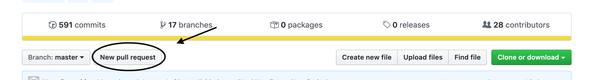

# How to hand in homework

From this module on you'll submit your homework only using GIT and GitHub.

## 1. GitHub homework guide

<a href="http://www.youtube.com/watch?feature=player_embedded&v=CpYARPYGQU8" target="_blank"></a>

Watch the video (by clicking the image) or go through the following walk-through to learn how to submit your homework:

ONE TIME ONLY (START OF EVERY MODULE)

1. Create a [fork](https://help.github.com/en/articles/fork-a-repo) of the module repository. For JavaScript1, the module repository is `https://www.github.com/HackYourHomework/JavaScript1`. (You can find the `fork` option on the top right corner of the repository.)
2. Navigate to the URL of the cloned repository (it should be in your personal GitHub account, under "repositories")
3. Clone the repository, using SSH, to your local machine. You can do this by typing in `git clone <git url>` in the command line
4. On your local machine, navigate to the folder using the command line
5. Make sure you've cloned it correctly by running `git status` from the command line.

EVERY WEEK

1. Create a new branch for each week you have homework. For example, for the week 1 homework for JavaScript1 create a branch called `week1-YOURNAME`
2. Create a folder called `homework` inside of each week's folder. So for example, inside of the `Week1` folder, create a new folder called `homework`
3. Once you're finished, add and commit everything. Make the commit message meaningful, for example `finished project for homework week1`
4. Push the branch to your forked repository
5. On the GitHub page of your forked repository, click on the `create pull request` button. Make sure that the `base repository` is the module repository E.g. `https://www.github.com/HackYourHomework/JavaScript1`, on branch `master`.
6. Give the pull request a title in the following format:

```markdown
Homework week 1 <Your_name>
```

7. Submit the pull request from your forked repository into the original. You can do this by clicking 'new pull request':



8. Do a little victory dance because you did it! Good job!

If you have any questions or if something is not entirely clear ¯\\\_(ツ)\_/¯, please ask/comment on Slack!
